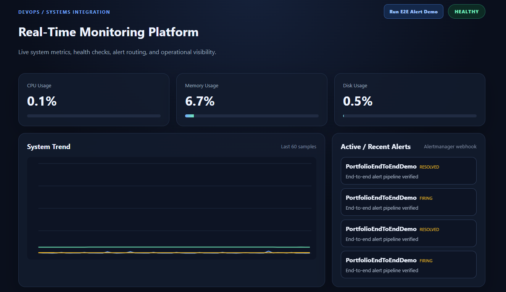
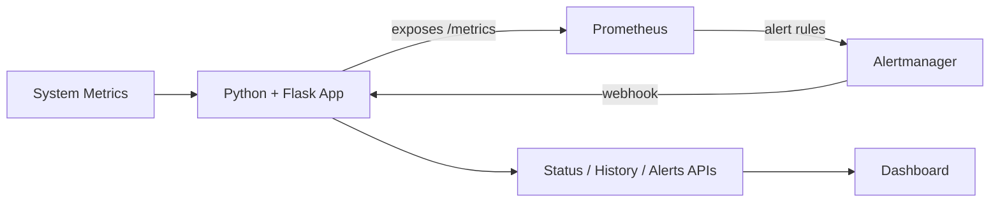
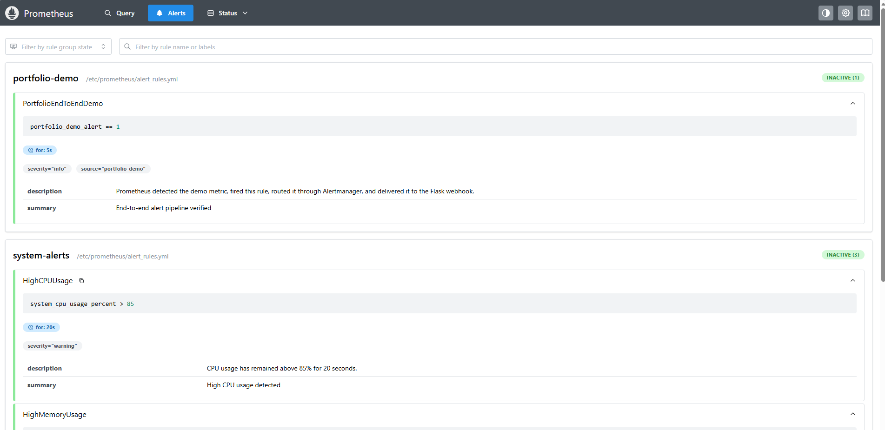
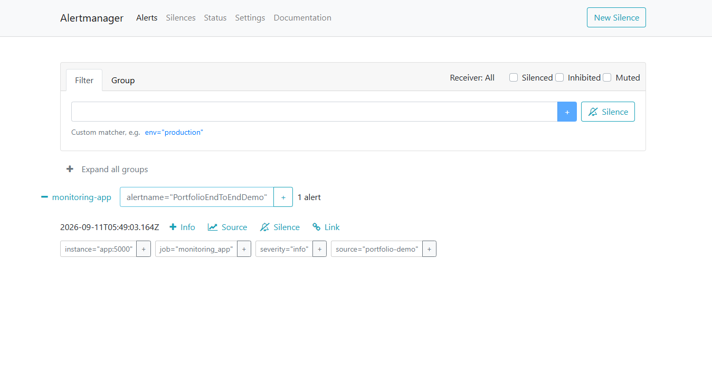
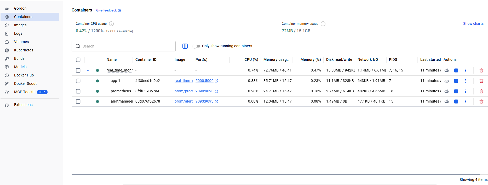

# Real-Time Monitoring & Alerting Platform


A Dockerized real-time monitoring and alerting reference implementation built
with **Python, Flask, Prometheus, Alertmanager, and Docker Compose**. It collects
live system metrics, evaluates alert rules, routes notifications through
Alertmanager, and displays operational state and alert lifecycle events in a
web dashboard.

> Current release: **v1.1.0**



## Highlights

- Live CPU, memory, and disk monitoring with `psutil`
- Application health state and `/health` endpoint
- Native Prometheus metrics exposed at `/metrics`
- Prometheus alert rules for CPU, memory, and application degradation
- Alertmanager routing back to the application through a webhook
- `FIRING -> RESOLVED` alert lifecycle visibility
- 60-sample in-memory metric history and dashboard trend visualization
- Safe end-to-end alert demo without artificial CPU or memory stress
- Docker Compose deployment for the app, Prometheus, and Alertmanager
- Pinned monitoring images for reproducible local runs
- Automated API tests and GitHub Actions CI

## Architecture



For component behavior, alert timing, state management, and production-hardening
notes, see **[docs/architecture.md](docs/architecture.md)**.

## Technology stack

| Layer | Technology | Purpose |
| --- | --- | --- |
| Monitoring service | Python 3.12 + Flask | Metrics collection, APIs, webhook receiver, dashboard |
| Metrics | `prometheus-client` + `psutil` | Prometheus exposition and system sampling |
| Metrics backend | Prometheus 3.14.0 | Scraping and alert-rule evaluation |
| Alert routing | Alertmanager 0.34.0 | Grouping, routing, firing/resolved webhook delivery |
| Process server | Gunicorn | Containerized Flask serving |
| Deployment | Docker Compose | Reproducible multi-service environment |
| Tests | Pytest | Endpoint and webhook behavior validation |

## Quick start with Docker

### Requirements

- Docker Desktop or Docker Engine with Compose v2
- Ports `5000`, `9090`, and `9093` available locally

### Start the stack

```bash
git clone https://github.com/YOUR_GITHUB_USERNAME/real-time-monitoring-platform.git
cd real-time-monitoring-platform
cp .env.example .env   # optional; on PowerShell use: Copy-Item .env.example .env
docker compose up --build -d
```

Verify the containers:

```bash
docker compose ps
```

Open:

| Service | URL |
| --- | --- |
| Dashboard | http://localhost:5000 |
| Application health | http://localhost:5000/health |
| Prometheus metrics | http://localhost:5000/metrics |
| Prometheus | http://localhost:9090 |
| Alertmanager | http://localhost:9093 |

Stop the stack:

```bash
docker compose down
```

## Safe end-to-end alert demo

The demo tests the full alerting chain without loading the machine artificially.
With the stack running, click **Run E2E Alert Demo** in the dashboard or call:

```bash
curl -X POST http://localhost:5000/api/demo/alert
```

PowerShell:

```powershell
Invoke-RestMethod -Method Post -Uri http://localhost:5000/api/demo/alert
```

The application raises `portfolio_demo_alert=1` for 20 seconds. Prometheus
scrapes that metric, holds the demo rule for 5 seconds, sends the firing alert
to Alertmanager, and Alertmanager posts it to the Flask webhook. After the
metric resets, a resolved notification follows.

```text
Demo Trigger
    -> Flask metric
    -> Prometheus scrape
    -> Alert rule
    -> Alertmanager
    -> Flask webhook
    -> Dashboard FIRING / RESOLVED events
```

## Alert rules

| Alert | Condition | Duration | Severity |
| --- | --- | ---: | --- |
| `HighCPUUsage` | CPU usage > 85% | 20s | warning |
| `HighMemoryUsage` | Memory usage > 85% | 20s | warning |
| `ApplicationDegraded` | `app_health_status == 0` | 10s | critical |
| `PortfolioEndToEndDemo` | `portfolio_demo_alert == 1` | 5s | info |

## API endpoints

| Method | Endpoint | Description |
| --- | --- | --- |
| `GET` | `/` | Operational dashboard |
| `GET` | `/health` | Application health and latest sampled state |
| `GET` | `/metrics` | Prometheus exposition format |
| `GET` | `/api/status` | Latest CPU, memory, disk, and health values |
| `GET` | `/api/history` | Last 60 metric snapshots |
| `GET` | `/api/alerts` | Last 100 received alert events |
| `POST` | `/api/demo/alert` | Trigger the safe end-to-end demo metric |
| `POST` | `/webhook/alertmanager` | Alertmanager webhook receiver |

## Run locally without Docker

Create a virtual environment and install development dependencies:

```bash
python -m venv .venv
```

Linux/macOS:

```bash
source .venv/bin/activate
pip install -r requirements-dev.txt
python run.py
```

Windows PowerShell:

```powershell
.\.venv\Scripts\Activate.ps1
pip install -r requirements-dev.txt
python run.py
```

> Running only the Flask service provides the dashboard, API, health endpoint,
> and metrics endpoint. Prometheus and Alertmanager are required for the full
> end-to-end alert path.

## Configuration

Copy `.env.example` to `.env` before starting Docker Compose if you want to
change the sampling interval:

```dotenv
MONITOR_INTERVAL_SECONDS=2
```

Values below 0.5 seconds are clamped to 0.5 seconds by the application.

## Tests

```bash
pip install -r requirements-dev.txt
pytest -q
```

The test suite currently checks:

- health endpoint behavior;
- Prometheus metrics exposure;
- safe demo endpoint behavior;
- Alertmanager zero `endsAt` timestamp normalization.

GitHub Actions runs the test suite automatically on pushes and pull requests to
`main`.

### Development test utilities

Two shell utilities intentionally test different layers:

- `scripts/trigger_e2e_demo.sh` calls `/api/demo/alert` and exercises the full
  Prometheus -> Alertmanager -> Flask webhook path.
- `scripts/send_direct_webhook_test.sh` posts an Alertmanager-shaped payload
  directly to the Flask webhook. It is useful for isolating webhook parsing and
  dashboard ingestion, but it **does not** verify Prometheus or Alertmanager.

## Project structure

```text
.
├── .github/
│   └── workflows/
│       └── ci.yml
├── alertmanager/
│   └── alertmanager.yml
├── app/
│   ├── static/
│   │   └── style.css
│   ├── templates/
│   │   └── dashboard.html
│   ├── __init__.py
│   ├── monitor.py
│   └── routes.py
├── docs/
│   ├── screenshots/
│   │   ├── alertmanager-routing.png
│   │   ├── dashboard.png
│   │   ├── docker-compose-stack.png
│   │   ├── prometheus-alert-rules.png
│   │   └── README.md
│   └── architecture.md
├── prometheus/
│   ├── alert_rules.yml
│   └── prometheus.yml
├── scripts/
│   ├── send_direct_webhook_test.sh
│   └── trigger_e2e_demo.sh
├── tests/
│   └── test_app.py
├── .dockerignore
├── .env.example
├── .gitignore
├── CHANGELOG.md
├── docker-compose.yml
├── Dockerfile
├── LICENSE
├── Makefile
├── README.md
├── requirements-dev.txt
├── requirements.txt
└── run.py
```

## Screenshots

| Dashboard | Prometheus alert rules |
| --- | --- |
|  |  |

| Alertmanager routing | Docker Compose stack |
| --- | --- |
|  |  |

## Current scope and production hardening

The repository intentionally keeps runtime state in memory so the complete flow
is easy to inspect and reproduce. This means metric history and received alert
events reset when the application restarts.

Before using this design in a production environment, consider adding persistent
storage, authentication/authorization, TLS, webhook protection, secrets
management, durable Prometheus storage, centralized logs, environment-specific
configuration, and an external state strategy for horizontal scaling. See the
[architecture document](docs/architecture.md#production-hardening-considerations)
for details.

## Changelog

See **[CHANGELOG.md](CHANGELOG.md)**.

## License

Released under the **MIT License**. See **[LICENSE](LICENSE)**.
