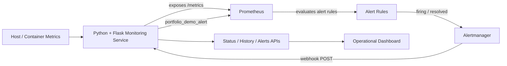
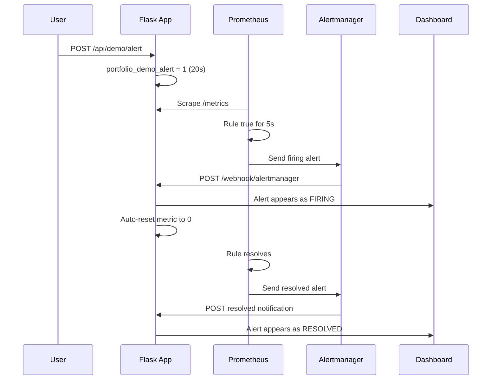

# Architecture

## Overview

The platform is a small observability and alerting stack designed to demonstrate
real-time system monitoring, rule evaluation, alert routing, webhook delivery,
and operational visibility in one reproducible Docker Compose environment.

## Components

### Flask monitoring service

The Python application is responsible for:

- sampling CPU, memory, and disk utilization with `psutil`;
- calculating a simple application health state;
- exposing Prometheus metrics at `/metrics`;
- keeping the latest 60 monitoring samples in memory;
- receiving Alertmanager webhooks at `/webhook/alertmanager`;
- keeping the latest 100 alert events in memory;
- serving the live dashboard and JSON APIs;
- triggering a safe portfolio demo metric without generating artificial load.

The monitor runs in a daemon thread. The Docker image intentionally runs one
Gunicorn worker with multiple threads because metric state and the short-lived
history/alert stores are process-local.

### Prometheus

Prometheus scrapes the Flask service every 5 seconds and evaluates rules every
5 seconds. Current rules are:

| Alert | Expression | Hold time | Severity |
| --- | --- | ---: | --- |
| `HighCPUUsage` | `system_cpu_usage_percent > 85` | 20s | warning |
| `HighMemoryUsage` | `system_memory_usage_percent > 85` | 20s | warning |
| `ApplicationDegraded` | `app_health_status == 0` | 10s | critical |
| `PortfolioEndToEndDemo` | `portfolio_demo_alert == 1` | 5s | info |

### Alertmanager

Alertmanager groups alerts by `alertname` and sends them to the Flask webhook.
`send_resolved: true` is enabled so the dashboard receives both sides of the
alert lifecycle.

Current routing timings:

- `group_wait`: 5 seconds
- `group_interval`: 10 seconds
- `repeat_interval`: 1 hour

### Dashboard

The dashboard polls application APIs and visualizes:

- current CPU, memory, and disk utilization;
- overall application health;
- recent 60-sample metric history;
- recent Alertmanager events, including `firing` and `resolved` states.

## End-to-end demo sequence

The safe demo proves the complete alert path without stressing the machine:

## Data and state model

This repository intentionally uses in-memory data structures:

- monitoring history: `deque(maxlen=60)`;
- received alerts: `deque(maxlen=100)`;
- current monitoring state: Python dictionary;
- demo trigger: Prometheus `Gauge`.

This keeps the reference implementation easy to run and inspect. Restarting the
application clears history and alert events.

## Production-hardening considerations

This project is a reference implementation, not a complete production
observability platform. A production deployment would normally add:

- persistent or external storage for operational history and incidents;
- authentication and authorization for the dashboard and write endpoints;
- TLS and a reverse proxy or ingress layer;
- protected Alertmanager webhook authentication or network policy;
- durable Prometheus storage and backup/retention policies;
- structured application logging and centralized log collection;
- secrets management instead of plaintext configuration;
- external state or Prometheus multiprocess handling before horizontal scaling;
- CI/CD deployment stages, image scanning, and environment-specific configuration.

Documenting these boundaries is intentional: the repository demonstrates the
monitoring and alert-routing mechanics without pretending to include every
production control.
